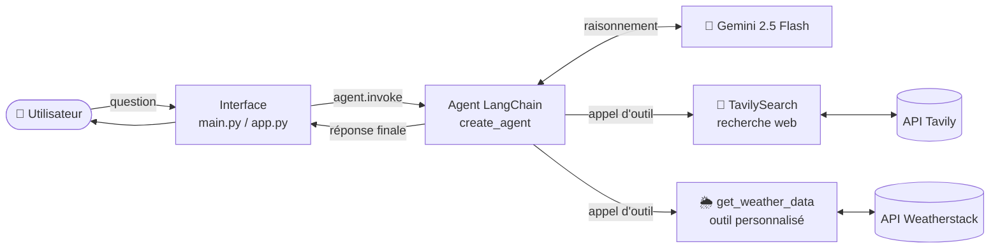
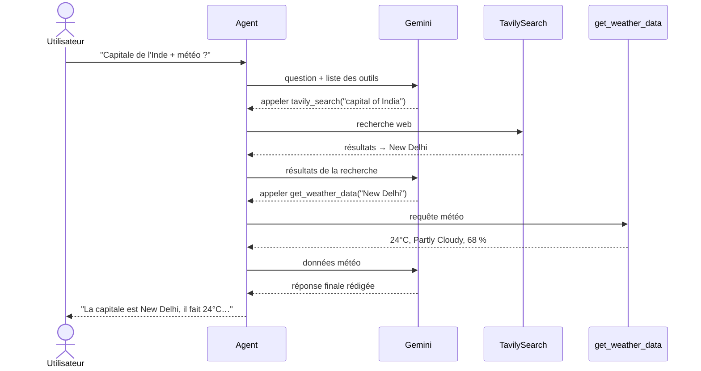
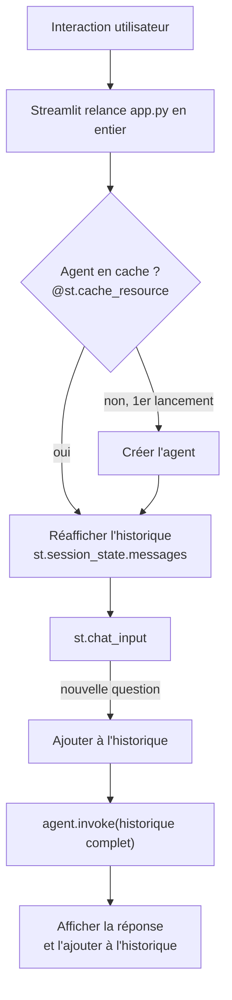

# 🤖 LangChain Agent : recherche web & météo

Agent conversationnel construit avec **LangChain 1.x** et **Google Gemini 2.5 Flash**. Il décide lui-même quand chercher sur le web (**Tavily**) ou consulter la météo en temps réel (**Weatherstack**) pour répondre à une question.

Le projet est disponible sous trois formes :

| Fichier | Usage |
|---|---|
| [`research/agent_demo.ipynb`](research/agent_demo.ipynb) | Notebook d'exploration, étape par étape |
| [`main.py`](main.py) | Script en ligne de commande |
| [`app.py`](app.py) | Interface de chat web avec **Streamlit** |

---

## 📐 Architecture



- **Le LLM** (Gemini) raisonne et choisit les outils à appeler, ainsi que leurs arguments.
- **Les outils** donnent à l'agent accès à des informations récentes qu'il ne connaît pas.
- **L'agent** (`create_agent`) orchestre la boucle *raisonnement → outil → observation* jusqu'à la réponse finale.

> **Pourquoi un agent ?** Un LLM appelé seul (`llm.invoke(...)`) répond uniquement avec ses connaissances d'entraînement, qui s'arrêtent à une certaine date : ses informations « récentes » sont donc dépassées. L'agent lui permet d'aller chercher des données à jour.

---

## 🔄 Déroulement d'une requête

Exemple réel : *« Find the capital of India and then find its current weather. »*



L'agent **enchaîne plusieurs outils** : le résultat du premier (la ville) sert d'argument au second.

---

## 🗂️ Structure

```
Langchain-Agent/
├── app.py               # Interface Streamlit (chat)
├── main.py              # Version ligne de commande
├── .env                 # Clés API (non versionné)
└── research/
    ├── agent_demo.ipynb # Notebook d'exploration
    └── .env             # Clés API du notebook (non versionné)
```

Les dépendances sont gérées avec **uv** dans le `pyproject.toml` à la racine du dépôt.

---

## 🧰 Stack technique

| Composant | Rôle |
|---|---|
| `langchain` (`create_agent`, `@tool`) | Création de l'agent et des outils |
| `langchain-google-genai` | Connexion au modèle Gemini |
| `langchain-tavily` | Outil de recherche web |
| `requests` | Appel à l'API Weatherstack |
| `python-dotenv` | Chargement des clés depuis `.env` |
| `streamlit` | Interface web de chat |
| `certifi` | Certificats SSL (évite les erreurs HTTPS sous Windows) |

---

## ⚙️ Installation

### 1. Prérequis
- Python **3.13+**
- [uv](https://docs.astral.sh/uv/)

### 2. Dépendances
Depuis la racine du dépôt :
```bash
uv sync
```

### 3. Clés API
Créer un fichier `Langchain-Agent/.env` :
```env
GOOGLE_API_KEY=...
TAVILY_API_KEY=...
WEATHERSTACK_API_KEY=...
```

| Clé | Où l'obtenir | Gratuit |
|---|---|---|
| `GOOGLE_API_KEY` | [aistudio.google.com/apikey](https://aistudio.google.com/apikey) | ✅ |
| `TAVILY_API_KEY` | [tavily.com](https://tavily.com) | ✅ (quota mensuel) |
| `WEATHERSTACK_API_KEY` | [weatherstack.com](https://weatherstack.com) | ✅ (quota mensuel) |

> ⚠️ `load_dotenv()` charge le `.env` **le plus proche du script**. `main.py`/`app.py` utilisent `Langchain-Agent/.env` et le notebook utilise `research/.env` : une clé doit être présente dans le bon fichier.

---

## ▶️ Utilisation

Depuis le dossier `Langchain-Agent/` :

**Ligne de commande**
```bash
uv run python main.py
```

**Interface web**
```bash
uv run streamlit run app.py
```
L'application s'ouvre sur http://localhost:8501.

---

## 🔍 Fonctionnement détaillé

### Les outils
- **`TavilySearch(max_results=2)`** est un outil prêt à l'emploi. Il renvoie un `dict` dont les résultats sont dans la clé `"results"`.
- **`get_weather_data(city)`** est une fonction Python transformée en outil par le décorateur `@tool`. Sa **docstring** est lue par le LLM pour savoir *quand* l'utiliser : elle doit être claire. Une fois décorée, elle s'appelle avec `get_weather_data.invoke("Dakar")`.

### L'agent
```python
agent = create_agent(model=llm, tools=tools, system_prompt="...")
response = agent.invoke({"messages": [{"role": "user", "content": question}]})
print(response["messages"][-1].text)
```
- `response["messages"]` contient **toute la conversation** : question, appels d'outils, résultats, réponse finale.
- `[-1]` est le dernier message, c'est-à-dire la réponse finale.
- `.text` extrait le texte. Avec Gemini, `.content` est une *liste de blocs*, pas une simple chaîne.

### `invoke` ou `stream`

| Méthode | Retour | Quand l'utiliser |
|---|---|---|
| `agent.invoke(...)` | L'état final uniquement | En production, quand seule la réponse compte |
| `agent.stream(..., stream_mode="values")` | L'état après chaque étape | Pour apprendre ou déboguer, afin de voir les appels d'outils |

### Interface Streamlit



- **`@st.cache_resource`** : l'agent est créé une seule fois, et non à chaque interaction.
- **`st.session_state`** : conserve l'historique entre les relances du script.
- **Historique complet envoyé à l'agent** : il se souvient du contexte, par exemple « et la météo là-bas ? ».

---

## 🩺 Dépannage

| Erreur / symptôme | Cause | Solution |
|---|---|---|
| `NameError: name 'search_tool' is not defined` | Variable utilisée avant d'être créée | Définir l'outil avant de l'utiliser |
| Rien ne s'affiche dans le terminal | Dans un script, une valeur non affichée est perdue (seul Jupyter l'affiche) | Utiliser `print(...)` |
| `Did not find tavily_api_key` / `API key required for Gemini` | Clé absente du `.env` lu par le script | Ajouter la clé dans `Langchain-Agent/.env` |
| `429 insufficient_quota` (OpenAI) | Plus de crédits sur le compte OpenAI | Recharger, ou utiliser Gemini (gratuit) |
| Réponse affichée sous forme `[{'type': 'text', ...}]` | Gemini renvoie `.content` en liste de blocs | Utiliser `.text` |
| Informations d'actualité dépassées | LLM appelé sans outils | Passer par l'agent avec `TavilySearch` |
| Avertissement `Direct use of automatic function calling (AFC)...` | Message interne de la bibliothèque Google | Sans impact, à ignorer |

---

## 🚀 Pistes d'évolution

- Afficher dans Streamlit les outils appelés par l'agent (`st.status` + `agent.stream`)
- Ajouter d'autres outils : conversion de devises, calculatrice, Wikipédia…
- Gérer les erreurs réseau des API (timeouts, quotas dépassés)
- Mémoire persistante des conversations (checkpointer LangGraph)
- Déploiement sur Streamlit Community Cloud
